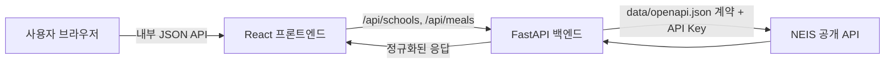

# 급식 배틀 - 학교 급식 조회 앱 TRD

## 1. 문서 목적

이 문서는 `PRD.md`의 요구사항을 구현하기 위한 기술 설계를 정의한다. 구현 시
NEIS 외부 API 계약은 `data/openapi.json`, 프론트엔드와 백엔드 사이의 내부 API
계약은 `src/openapi.json`을 단일 기준으로 사용한다.

## 2. 기술 목표와 제약

- React 기반 프론트엔드와 Python 기반 백엔드를 분리한다.
- 브라우저는 백엔드 API만 호출하며 NEIS API를 직접 호출하지 않는다.
- 백엔드만 NEIS 인증키를 보유하고 `data/openapi.json`에 따라 NEIS API를
  호출한다.
- 프론트엔드와 백엔드는 각각 별도의 클라이언트/서비스 계층에서 API 통신을
  구현한다.
- 두 앱은 Docker 이미지로 빌드하고 Docker Compose로 함께 실행한다.
- 이번 구현은 조회 전용이며 데이터베이스를 도입하지 않는다.

## 3. 권장 기술 스택

| 영역 | 기술 | 선택 이유 |
|---|---|---|
| 프론트엔드 | React, TypeScript, Vite | 타입 안전한 컴포넌트 개발과 간단한 빌드 구성 |
| 스타일 | CSS 디자인 토큰과 컴포넌트 스타일 | Linear에서 영감을 받은 시각 체계를 불필요한 UI 프레임워크 종속 없이 일관되게 적용 |
| 백엔드 | Python, FastAPI, Pydantic | 비동기 HTTP API, 입력 검증 및 OpenAPI 지원 |
| 외부 HTTP | `httpx` | FastAPI와 함께 비동기 호출 및 타임아웃을 명시하기 용이 |
| 프론트엔드 테스트 | Vitest, React Testing Library, MSW | 사용자 관점 통합 테스트와 API 모킹 |
| 백엔드 테스트 | pytest, FastAPI TestClient 또는 `httpx` | 단위 및 API 통합 테스트 |
| E2E | Playwright | 브라우저 기반 전체 흐름 검증 |
| 실행 | Docker, Docker Compose | 동일한 로컬 실행 환경과 서비스 오케스트레이션 |

정확한 버전은 구현 시점의 안정 버전으로 잠그고 각 패키지 관리자의 잠금 파일을
커밋한다.

## 4. 저장소 구조

```text
.
|-- data/
|   `-- openapi.json             # NEIS 외부 API 계약
|-- src/
|   |-- openapi.json             # 프론트엔드-백엔드 내부 API 계약
|   |-- frontend/
|   |   |-- src/
|   |   |   |-- api/             # 내부 API 클라이언트와 계약 타입
|   |   |   |-- components/
|   |   |   |-- features/
|   |   |   `-- styles/
|   |   |-- Dockerfile
|   |   `-- package.json
|   `-- backend/
|       |-- app/
|       |   |-- api/             # HTTP 라우트
|       |   |-- clients/         # NEIS 전용 클라이언트
|       |   |-- models/          # 내부 및 외부 데이터 모델
|       |   |-- services/        # 변환 및 유스케이스
|       |   `-- main.py
|       |-- tests/
|       |-- Dockerfile
|       `-- pyproject.toml
|-- e2e/
|-- compose.yml
|-- .env.example
|-- PRD.md
`-- TRD.md
```

`src/openapi.json`은 내부 API의 명시적 계약 파일이다. 프론트엔드는 이 계약을
기준으로 작성한 전용 클라이언트만 사용하고, `data/openapi.json`에 정의된 NEIS
경로나 대문자 원본 필드에 의존하지 않는다.

## 5. 시스템 구성



### 5.1 프론트엔드 책임

- 학교 검색, 학교 선택, 날짜 범위 선택 및 결과 표시
- 클라이언트에서 즉시 판단할 수 있는 입력 검증
- 로딩, 빈 상태 및 오류 상태 관리
- `src/openapi.json`에 맞는 내부 API 클라이언트 제공
- 반응형, 키보드 사용성 및 접근성 구현

### 5.2 백엔드 책임

- 요청 입력의 최종 검증
- NEIS 인증키의 서버 측 보관
- `data/openapi.json`에 맞는 별도 NEIS 클라이언트 제공
- NEIS 응답 검증과 내부 계약 모델로의 정규화
- 외부 API 오류를 안정적인 내부 오류 형식으로 변환
- CORS, 타임아웃 및 로그 관리

## 6. 데이터 흐름

### 6.1 학교 검색

1. 프론트엔드는 검색어를 정리한 뒤 내부 학교 검색 API를 호출한다.
2. 백엔드는 NEIS `/hub/schoolInfo`에 `SCHUL_NM`과 공통 파라미터를 전달한다.
3. NEIS 클라이언트가 응답 구조와 `RESULT` 코드를 검증한다.
4. 백엔드는 `ATPT_OFCDC_SC_CODE`, `SD_SCHUL_CODE`, `SCHUL_NM`,
   `SCHUL_KND_SC_NM`, `LCTN_SC_NM`, `ORG_RDNMA`를 내부 모델로 변환한다.
5. 프론트엔드는 학교 코드가 아니라 사용자에게 유용한 이름, 지역, 종류와 주소를
   표시하고 선택된 학교의 코드를 상태에 보관한다.

### 6.2 급식 조회

1. 프론트엔드는 선택한 학교 코드, 교육청 코드, 시작일과 종료일을 백엔드에
   전달한다.
2. 백엔드는 날짜 순서와 최대 31일 범위를 다시 검증한다.
3. 백엔드는 NEIS `/hub/mealServiceDietInfo`에 학교 코드, 교육청 코드,
   `MMEAL_SC_CODE=2`, `MLSV_FROM_YMD`, `MLSV_TO_YMD`를 전달한다.
4. NEIS 클라이언트는 `MLSV_YMD`, `DDISH_NM`, `CAL_INFO`, `NTR_INFO` 등 필요한
   필드를 정규화한다.
5. 백엔드는 중식 데이터만 날짜 오름차순으로 반환한다.

NEIS의 `DDISH_NM`처럼 HTML 줄바꿈 또는 알레르기 번호 표기가 포함될 수 있는
문자열은 백엔드에서 안전한 문자열 배열로 정규화한다. 외부 HTML을 프론트엔드에
그대로 주입하지 않는다.

## 7. 내부 API 계약

`src/openapi.json`은 OpenAPI 3.x JSON 문서로 작성하고 아래 동작을 포함한다.
필드명은 프론트엔드에 적합한 `camelCase`를 사용한다.

### 7.1 `GET /api/schools`

학교 이름 일부로 학교를 검색한다.

| 쿼리 | 타입 | 규칙 |
|---|---|---|
| `query` | string | 필수, 앞뒤 공백 제거 후 1자 이상 |
| `page` | integer | 기본값 1, 1 이상 |
| `pageSize` | integer | 기본값 20, 1~100 |

성공 응답 예시:

```json
{
  "items": [
    {
      "officeCode": "B10",
      "schoolCode": "7010569",
      "name": "예시고등학교",
      "region": "서울특별시",
      "schoolType": "고등학교",
      "address": "서울특별시 ..."
    }
  ],
  "totalCount": 1,
  "page": 1,
  "pageSize": 20
}
```

검색 결과가 없으면 오류가 아닌 `200`과 빈 `items`를 반환한다.

### 7.2 `GET /api/meals`

선택한 학교와 날짜 범위의 중식을 조회한다.

| 쿼리 | 타입 | 규칙 |
|---|---|---|
| `officeCode` | string | 필수 |
| `schoolCode` | string | 필수 |
| `from` | string(date) | 필수, ISO `YYYY-MM-DD` |
| `to` | string(date) | 필수, ISO `YYYY-MM-DD`, `from` 이상 |

성공 응답 예시:

```json
{
  "school": {
    "officeCode": "B10",
    "schoolCode": "7010569",
    "name": "예시고등학교"
  },
  "from": "2026-08-17",
  "to": "2026-08-21",
  "items": [
    {
      "date": "2026-08-17",
      "mealType": "중식",
      "dishes": ["현미밥", "미역국", "배추김치"],
      "calories": "650.1 Kcal",
      "nutrition": "탄수화물(g): 90.1"
    }
  ]
}
```

급식 정보가 없으면 `200`과 빈 `items`를 반환한다.

### 7.3 오류 계약

모든 내부 API 오류는 다음 형식을 사용한다.

```json
{
  "error": {
    "code": "INVALID_DATE_RANGE",
    "message": "시작일은 종료일보다 늦을 수 없습니다.",
    "requestId": "generated-request-id",
    "fields": {
      "from": "날짜 범위를 확인해 주세요."
    }
  }
}
```

| HTTP 상태 | 용도 |
|---|---|
| 400 | 형식은 맞지만 날짜 순서 또는 기간 제한이 잘못된 요청 |
| 422 | 필수 값 누락 또는 형식 오류 |
| 502 | NEIS의 잘못된 응답 또는 외부 서비스 오류 |
| 503 | NEIS 인증, 호출 한도 또는 일시적 사용 불가 |
| 504 | NEIS 호출 타임아웃 |

내부 오류 메시지에는 API 키, 외부 요청 URL의 민감한 쿼리 또는 스택 추적을
포함하지 않는다.

## 8. NEIS 클라이언트 설계

- 기준 계약은 `data/openapi.json`이며 서버 URL은
  `https://open.neis.go.kr`이다.
- 모든 요청에 서버 환경 변수의 인증키, `Type=json`, 유효한 `pIndex`와
  `pSize`를 전달한다.
- 학교 검색은 전체 결과 수를 포함하는 NEIS 페이지 구조를 내부 페이지 모델로
  변환한다.
- 급식 조회는 필요한 경우 페이지를 순회해 선택 기간의 결과가 누락되지 않게
  한다.
- 연결 및 응답 타임아웃을 명시하고 무제한 재시도하지 않는다.
- 네트워크 오류와 `ERROR-*`/`INFO-*` 결과 코드를 구분해 상위 서비스에
  구체적인 예외로 전달한다.
- 외부 응답은 신뢰하지 않고 Pydantic 모델로 필수 필드와 날짜 형식을 검증한다.
- API 키는 로그, 오류 응답 및 테스트 픽스처에 기록하지 않는다.

NEIS의 "해당하는 데이터가 없음" 결과는 학교 검색과 급식 조회에서 정상적인 빈
결과로 변환하고, 인증 실패나 호출 한도 초과는 빈 결과로 위장하지 않는다.

## 9. 프론트엔드 설계

### 9.1 상태 모델

화면 상태는 `search`, `date`, `results` 세 단계로 관리한다.

- 검색어와 검색 결과
- 선택된 학교
- 시작일과 종료일
- 급식 결과
- 각 요청의 `idle`, `loading`, `success`, `empty`, `error` 상태

서버 데이터 캐시 도구를 도입한다면 요청 키에 검색어 또는 학교·날짜 조합을
포함한다. 학교가 바뀌면 이전 급식 결과를 즉시 무효화한다.

### 9.2 Linear에서 영감을 받은 UI

- 색상, 간격, 반경, 경계선, 타이포그래피를 CSS 변수 기반 디자인 토큰으로
  정의한다.
- 배경과 표면은 중립색, 핵심 CTA와 포커스 링은 한 가지 강조색을 사용한다.
- 얇은 경계선과 작은 반경을 기본으로 하고 깊은 그림자와 유리 효과는 피한다.
- 콘텐츠 최대 너비를 두고 3단계 진행 표시, 입력 패널, 결과 목록을 명확히
  구분한다.
- 결과는 정보 밀도가 높은 행 또는 카드로 표시하되 날짜, 메뉴, 부가 영양 정보
  순으로 시각적 위계를 둔다.
- `Enter` 검색, 화살표 키 결과 이동, `Enter` 선택, `Escape` 결과 목록 닫기를
  지원한다.
- 모바일에서는 단일 열로 전환하고 주요 버튼을 충분한 터치 크기로 제공한다.
- 스켈레톤이나 진행 표시가 레이아웃을 밀어내지 않게 영역 크기를 유지한다.

모든 인터랙티브 요소는 의미 있는 HTML 요소를 사용하고, 직접 구현한 콤보박스는
필요한 ARIA 역할과 활성 항목 관계를 제공한다.

### 9.3 API 클라이언트

- `src/openapi.json`의 경로 및 스키마에 대응하는 타입과 호출 함수를 별도
  모듈에 둔다.
- 컴포넌트에서 `fetch`를 직접 호출하지 않는다.
- 성공과 오류 응답을 런타임에서 구분하고 계약에 없는 응답은 명시적 오류로
  처리한다.
- API 기본 URL은 빌드 또는 런타임 환경 설정으로 주입한다.

## 10. 백엔드 설계

- 라우트는 HTTP 입력과 출력 변환만 담당한다.
- 서비스 계층은 날짜 규칙, 중식 필터링, 정렬과 외부-내부 모델 변환을 담당한다.
- NEIS 클라이언트는 외부 HTTP 요청과 외부 계약 파싱만 담당한다.
- 앱 시작 시 필수 환경 변수를 검증하고 누락되면 명확한 오류로 시작을 중단한다.
- `/health`는 프로세스 상태를 확인하며 API 키 값을 반환하거나 불필요한 NEIS
  호출을 수행하지 않는다.
- 요청 ID를 생성 또는 전달하고 구조화 로그에 경로, 상태, 처리 시간을 남긴다.

### 10.1 입력 검증

- 학교 검색어는 앞뒤 공백을 제거한 뒤 비어 있으면 거부한다.
- 날짜는 실제 달력 날짜인지 검증하고 ISO 형식만 내부 API에서 허용한다.
- 시작일은 종료일 이하여야 하며 포함 기간은 최대 31일이다.
- 외부 API에는 내부에서 검증하고 변환한 `YYYYMMDD` 날짜만 전달한다.

### 10.2 CORS

개발 환경에서는 명시적으로 설정한 프론트엔드 origin만 허용한다. 와일드카드
origin과 자격 증명 허용을 함께 사용하지 않는다. 운영 환경의 origin은 환경
변수로 주입한다.

## 11. 설정과 비밀 관리

`.env.example`에는 값 없이 다음 설정 이름과 설명만 제공한다.

| 변수 | 용도 |
|---|---|
| `NEIS_API_KEY` | 백엔드가 NEIS를 호출할 때 사용하는 필수 인증키 |
| `NEIS_BASE_URL` | 기본값이 있는 NEIS 서버 URL |
| `FRONTEND_ORIGIN` | 백엔드 CORS 허용 origin |
| `VITE_API_BASE_URL` | 프론트엔드의 백엔드 API 기준 URL |

실제 `.env`는 Git에서 제외한다. `NEIS_API_KEY`는 백엔드 컨테이너에만 전달하고
`VITE_` 접두사 변수나 프론트엔드 이미지 빌드 인자로 전달하지 않는다.

## 12. Docker Compose

`compose.yml`은 최소 두 서비스를 정의한다.

### 12.1 `backend`

- `src/backend/Dockerfile`에서 빌드한다.
- 내부 포트에서 FastAPI를 실행한다.
- `NEIS_API_KEY`, CORS 및 외부 API 설정을 주입한다.
- `/health` 기반 healthcheck를 제공한다.

### 12.2 `frontend`

- `src/frontend/Dockerfile`의 다단계 빌드로 정적 자산을 생성하고 웹 서버로
  제공한다.
- 브라우저의 `/api` 요청을 백엔드 서비스로 프록시하거나 명시적인 공개 백엔드
  URL을 사용한다.
- 백엔드 healthcheck가 준비된 뒤 시작하도록 구성하되, 런타임 API 오류도 UI에서
  처리한다.

두 서비스는 Compose 네트워크의 서비스 이름으로 통신한다. 로컬 실행에 필요한
명령과 `.env` 준비 절차는 구현 시 README에 추가한다.

## 13. 테스트 전략

### 13.1 프론트엔드 통합 테스트

프론트엔드에는 별도 단위 테스트를 요구하지 않고, 실제 컴포넌트 조합과 모킹된
내부 API를 이용한 통합 테스트를 작성한다.

- 부분 학교명 검색과 결과 렌더링
- 키보드로 학교 결과 이동 및 선택
- 검색 결과 없음 상태
- 학교 선택 후 날짜 단계 활성화
- 잘못된 날짜 순서 및 31일 초과 검증
- 급식 결과 날짜순 표시와 부가 정보 표시
- 급식 없음, 서버 오류 및 재시도
- 학교 변경 시 이전 급식 결과 초기화

### 13.2 백엔드 단위 테스트

- 날짜 변환, 순서 및 31일 제한
- NEIS 학교/급식 응답의 내부 모델 변환
- 중식 필터링과 날짜 정렬
- 요리명 줄바꿈 및 안전한 문자열 정규화
- NEIS 결과 코드별 예외 매핑
- 빈 결과와 실패 응답의 구분

### 13.3 백엔드 통합 테스트

실제 FastAPI 라우트와 모킹된 NEIS HTTP 응답을 사용한다.

- 학교 검색 성공, 페이지 정보 및 빈 결과
- 급식 조회 성공 및 빈 결과
- 요청 검증 오류
- NEIS 인증 실패, 한도 초과, 잘못된 응답 및 타임아웃의 내부 오류 변환
- 응답이 `src/openapi.json` 계약과 일치하는지 확인

테스트는 실제 NEIS API나 실제 인증키에 의존하지 않는다.

### 13.4 E2E 테스트

Docker Compose 또는 동등한 전체 스택에서 브라우저를 실행하고 제어 가능한
백엔드 외부 API 스텁을 사용한다.

1. 학교 이름 일부를 검색한다.
2. 검색 결과에서 학교를 선택한다.
3. 날짜 범위를 입력한다.
4. 조회를 실행한다.
5. 날짜별 중식 결과를 확인한다.

추가로 검색 결과 없음, 잘못된 날짜 범위, 급식 없음의 핵심 실패 흐름을 검증한다.
데스크톱과 모바일 viewport에서 최소 한 번씩 핵심 흐름을 실행한다.

## 14. 품질 및 운영 고려사항

- 프론트엔드 빌드 시 타입 검사와 정적 분석을 수행한다.
- 백엔드 테스트와 타입/정적 분석은 저장소에 채택한 도구로 수행한다.
- 외부 호출 시간과 결과 상태를 기록하되 메뉴 전문이나 API 키는 불필요하게
  로그에 남기지 않는다.
- 외부 API 응답을 영구 저장하지 않으며, 캐시를 추가할 경우 만료와 실패 시
  동작을 별도로 정의한다.
- 성능 측정은 `PRD.md`의 Core Web Vitals 목표를 기준으로 한다.

## 15. 기술 인수 조건 추적

| 이슈 인수 조건 | 설계 위치 |
|---|---|
| React 프론트엔드와 Python 백엔드 책임 | 3, 5장 |
| 프론트엔드의 NEIS 직접 호출 금지 | 2, 5, 9장 |
| `data/openapi.json` 기반 NEIS 연동 | 4, 6, 8장 |
| `src/openapi.json` 내부 계약 | 4, 7장 |
| Docker Compose 빌드 및 실행 | 12장 |
| 프론트엔드 통합 테스트 | 13.1장 |
| 백엔드 단위 및 통합 테스트 | 13.2~13.3장 |
| 전체 사용자 흐름 E2E 테스트 | 13.4장 |

